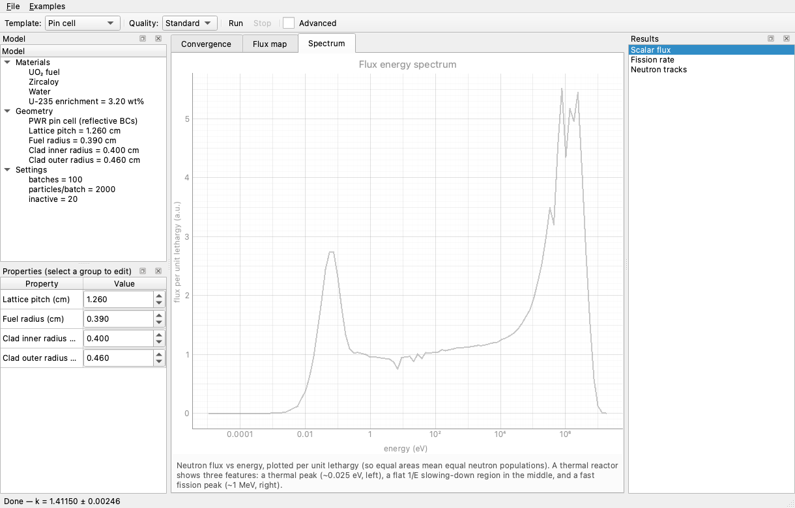
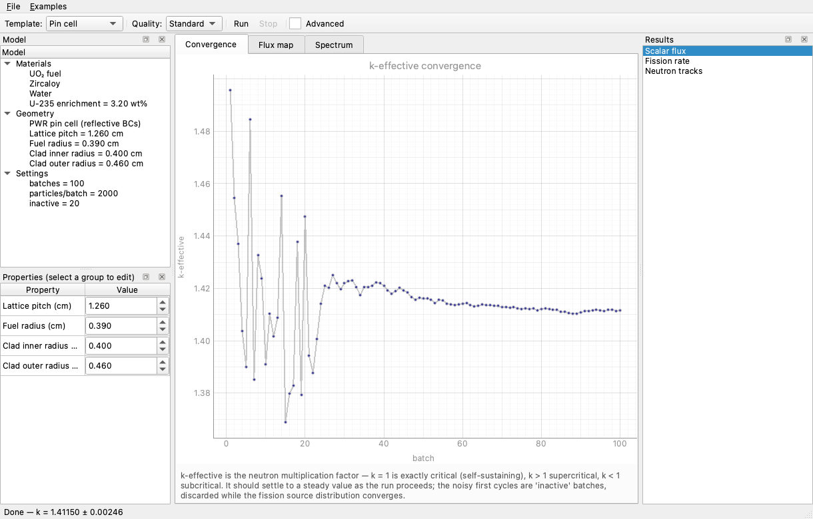
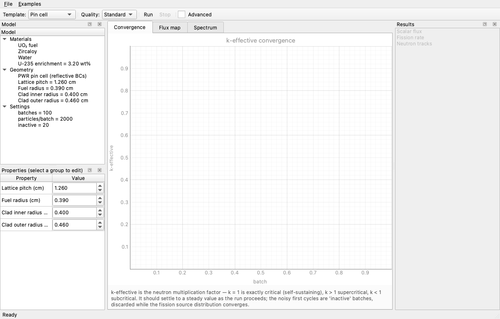
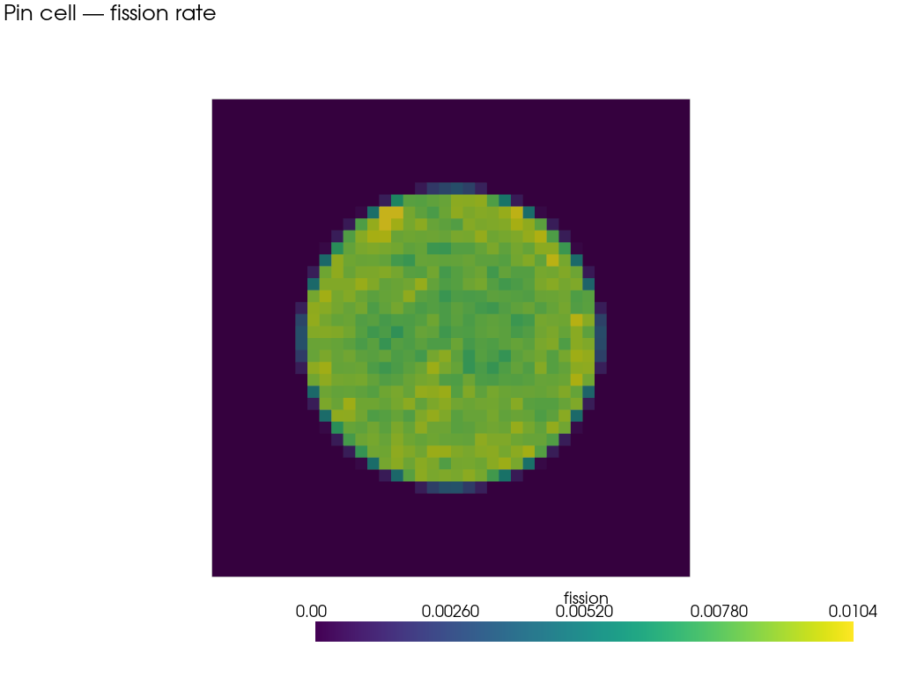
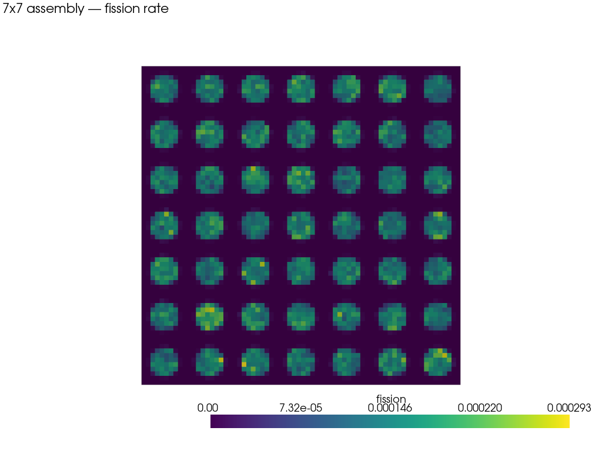
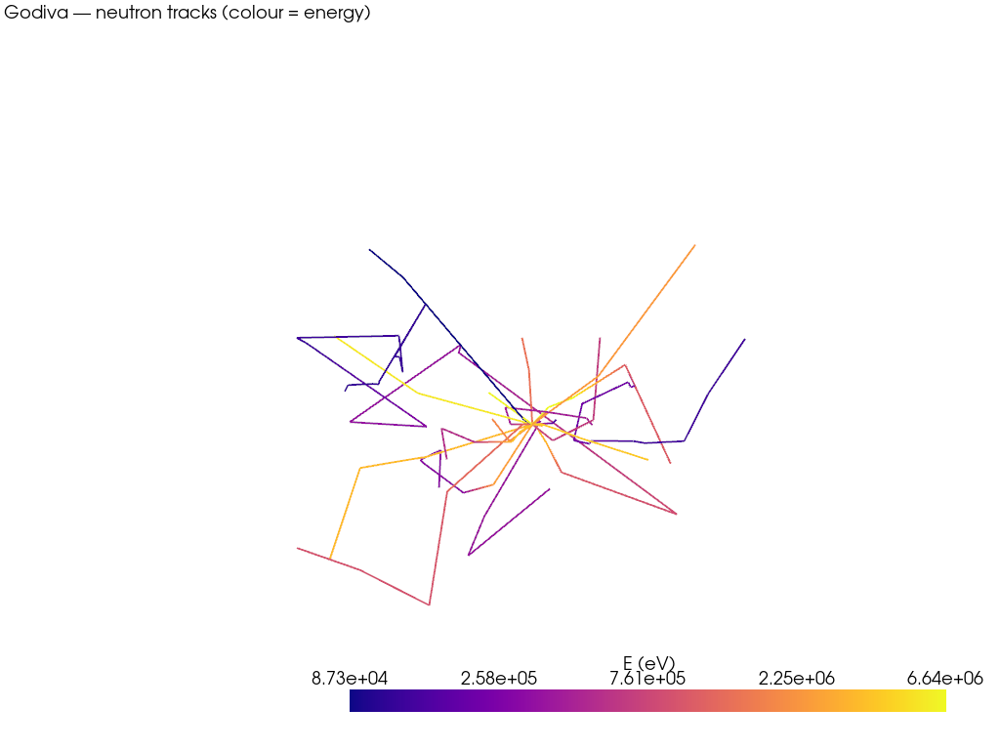
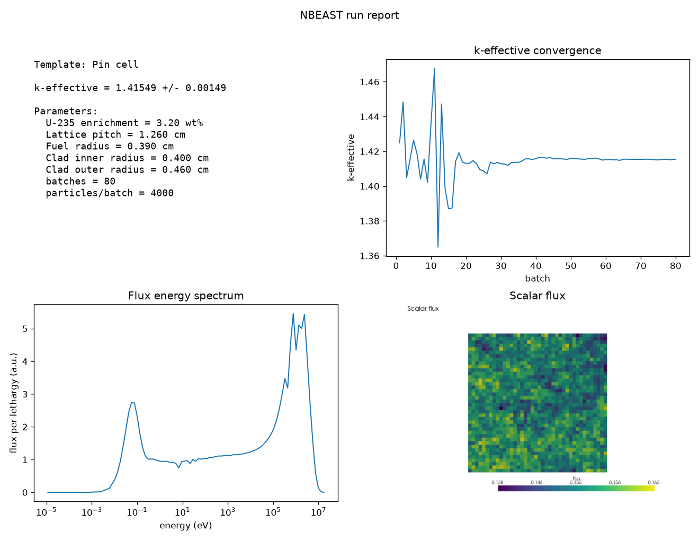
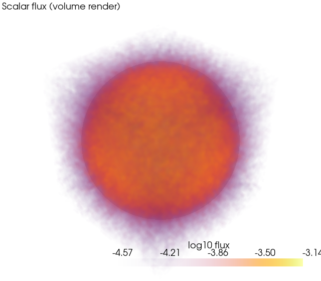

<div align="center">


# NBEAST

### Neutron-flux Monte Carlo simulation, made approachable.

An offline, open-source desktop GUI for neutron-transport Monte Carlo, built on
[OpenMC](https://openmc.org). Build a reactor model with a few clicks, watch criticality
converge live, and explore flux, fission, spectra, and neutron tracks — simple enough for
students, deep enough for experts.

[](https://github.com/SharpClaw007/NBEAST-Flux/actions/workflows/ci.yml)
[](https://www.python.org/)
[](https://openmc.org/)
[](https://doc.qt.io/qtforpython/)
[](https://pyvista.org/)
[](#native-on-apple-silicon--the-novel-part)
[](#getting-started)
[](LICENSE)

<br />



</div>

---

## Overview

Neutron-transport Monte Carlo is powerful but usually means hand-writing input decks and
running a CLI. NBEAST puts a real desktop GUI on top of OpenMC: pick a template, edit its
parameters in a tree, press **Run**, and see k-effective converge in real time. Results —
spatial flux and fission maps, the energy spectrum, and energy-colored neutron tracks — show
up in tabbed viewports, and a one-click export produces a report plus the exact, reproducible
OpenMC input deck.

It ships fully offline: the installer bundles Python, OpenMC, the GUI, and a curated
cross-section library, so there's nothing to set up and no internet needed to run a simulation.

It also runs **natively on Apple Silicon** — including an optional **CAD geometry** add-on that
imports real STEP models and runs neutron transport on them, powered by a from-scratch native
arm64 DAGMC/MOAB toolchain that doesn't exist anywhere upstream. See
[Native on Apple Silicon](#native-on-apple-silicon--the-novel-part).

## Features

- **Templated geometry** — pin cell, N×N fuel assembly, and bare sphere (Godiva), each
  defined by a handful of editable parameters with live values in the model tree.
- **Live criticality** — k-effective streams in per batch on a convergence plot as the
  simulation runs; **Stop** cancels cleanly.
- **Flux & fission maps** — 2-D slices of **scalar flux** and **fission rate**, rendered in
  an interactive 3-D viewport; switch fields in the Results panel.
- **Energy spectrum** — flux per unit lethargy vs energy, showing the thermal, slowing-down,
  and fast regions at a glance.
- **Neutron tracks** — sampled particle paths in 3-D, **colored by energy** so you can watch
  neutrons born fast and slow down.
- **CAD geometry** *(Apple-Silicon add-on)* — import a **STEP** model, assign a material to each
  solid, mesh it to a watertight DAGMC volume, and run criticality on it — k-eff, spectrum, and a
  spatial flux map, all native arm64. [More ↓](#cad-geometry--optional-apple-silicon-add-on)
- **Publication-style flux renders** — a 3-D **volume render** of the scalar-flux field with a
  log color scale, graded opacity (transparent low flux → glowing core), and a translucent
  geometry overlay — the "science-paper" look, for templates and CAD alike.
- **Editable parameters** — enrichment, pitch, radii, pins-per-side; what the tree shows is
  exactly what runs.
- **Swappable materials** — each material slot (fuel, cladding, moderator) is a **searchable
  dropdown** over a reactor-materials catalog (UO₂, MOX, U metal, steels, graphite, sodium, B₄C,
  light/heavy water…). Materials runnable with the offline data are usable immediately; the rest are
  flagged *needs data* and point you to the downloader.
- **Report & deck export** — a PDF/PNG report (k-eff, parameters, plots) plus CSV and the
  reproducible **OpenMC input deck** that produced it.
- **Projects & run history** — save your work to a project; every run is **archived and persists
  across sessions**, ready to reload into the viewports, compare, or remove.
- **Run-to-run comparison** — diff two runs side by side: **Δk with its combined uncertainty**
  (so you can tell a real reactivity effect from Monte Carlo noise), a parameter diff, and the two
  spectra overlaid.
- **Parameter sweeps & criticality search** — vary one parameter over a range and watch k respond,
  or **search for the value that makes the model critical** (enrichment-to-critical,
  radius-to-critical) — the calculator-to-instrument bridge.
- **Raw data export** — mesh-tally arrays **with uncertainties** to NumPy (`.npz`), CSV, or HDF5,
  for downstream analysis.
- **Fixed-source / shielding mode** — a water shield slab with a neutron beam; watch **flux and
  dose rate** attenuate through the shield (no k-eff — the door to shielding/dose/detector work).
- **Richer tallies** — reaction-rate maps (absorption, ν-fission), a **heating** (energy-deposition)
  map, and a **flux-to-dose-rate** map (ICRP coefficients), all in the Results panel.
- **Temperature / Doppler control** — set the temperature and watch reactivity respond; sweep it for
  the **temperature reactivity coefficient** (cross sections interpolated to the bundled data grid).
- **Multigroup cross sections** — collapse a run into a **complete few-group diffusion set**
  (CASMO-2/4/8/16: total, transport, absorption, fission, ν-fission, χ, the diffusion
  coefficient, and the P0 ν-scatter matrix), exportable to CSV/HDF5. Validated: a two-group
  infinite-medium solve of the exported constants reproduces the Monte Carlo k∞ to ~1%.
- **Depletion / burnup** *(optional add-on)* — track **k-effective vs burnup** as fuel depletes;
  needs a downloadable depletion chain + library (guided setup), so it stays out of the core bundle.
- **Simple ↔ Advanced** — Simple mode picks run quality for you; Advanced exposes batches and
  particles. **Validated examples** (Godiva ≈ 1.0, pin cell, assembly) are one click away.
- **Fully offline** — bundled cross-section data; no Python, conda, or network required.

## Validation

NBEAST's models are checked against published and textbook values — most importantly,
it reproduces the **Godiva** criticality benchmark (ICSBEP HEU-MET-FAST-001) **exactly
within uncertainty** (k = 1.00000 ± 0.00044 vs the published 1.0000 ± 0.0010). The fuel
**Doppler coefficient** (−3.59 pcm/K), pin-cell and assembly k∞, neutron spectra, water
shielding, and few-group constants all come out physically correct. See
[`docs/validation.md`](docs/validation.md) for the full table, method, and scope.

## Screenshots

<table>
  <tr>
    <td width="50%">
      <br />
      <sub><b>Live convergence</b> — k-effective per batch, settling to a steady value.</sub>
    </td>
    <td width="50%">
      <br />
      <sub><b>Editable model</b> — select a group in the tree, edit parameters in Properties.</sub>
    </td>
  </tr>
  <tr>
    <td width="50%">
      <br />
      <sub><b>Fission map (pin cell)</b> — fission confined to the fuel pellet, with the rim peak.</sub>
    </td>
    <td width="50%">
      <br />
      <sub><b>Fission map (7×7 assembly)</b> — the mesh resolves every pin.</sub>
    </td>
  </tr>
  <tr>
    <td width="50%">
      <br />
      <sub><b>Neutron tracks</b> — sampled paths radiating from the source, colored by energy.</sub>
    </td>
    <td width="50%">
      <br />
      <sub><b>Report export</b> — k-eff, parameters, convergence, spectrum, and flux on one page.</sub>
    </td>
  </tr>
</table>

> Screenshots use the built-in benchmark models (Godiva, a PWR pin cell, a 7×7 assembly)
> with ENDF/B-VIII.0 cross-section data.

## Native on Apple Silicon — the novel part

NBEAST runs **natively on Apple Silicon (arm64), with no Rosetta** — and that's the most novel
piece of engineering in the project. Continuous-energy neutron transport on M-series Macs is
already nice; the harder win is **CAD geometry**, which in OpenMC requires **DAGMC**, which
requires **MOAB** — and *none* of that chain has a usable macOS-arm64 build upstream (the
conda-forge work has been stalled for a long time). So NBEAST builds the whole thing from source,
bottom-up:

| Component | What we built | Why it's new |
|-----------|---------------|--------------|
| **OpenMC** | native arm64 compile from the feedstock recipe | conda-forge ships no `osx-arm64` OpenMC — the alternative is running under Rosetta |
| **MOAB + pymoab** | a self-contained arm64 wheel (scikit-build-core from git) | the release-tarball build is broken; no conda-forge arm64 `pymoab` exists |
| **DAGMC** | `dagmc 3.2.4` built for `osx-arm64` (conda-build) | no arm64 variant upstream; needed compiler-pin and Eigen 3.x fixes |
| **DAGMC-enabled OpenMC** | OpenMC's `dagmc` variant rebuilt on the above | the full CAD path, end to end, as Mach-O arm64 |

The result is the complete chain — **MOAB → DAGMC → DAGMC-OpenMC** — running as native arm64, so
CAD geometry → criticality works at full speed on Apple Silicon. Runs use **all** of the chip's
performance + efficiency cores via OpenMP by default. The recipes live under
[`packaging/moab-arm64/`](packaging/moab-arm64/), [`packaging/dagmc-arm64/`](packaging/dagmc-arm64/),
and [`packaging/openmc-arm64/`](packaging/openmc-arm64/).

## CAD geometry — optional Apple-Silicon add-on

Beyond the built-in templates, NBEAST can import a real CAD model and run neutron transport on it
directly:

- **STEP import** — load a `.step`/`.stp` assembly; NBEAST counts the solids and lets you assign a
  material to each from a preset library (HEU, UO₂, water, zircaloy).
- **Automatic meshing** — [`cad_to_dagmc`](https://github.com/fusion-energy/cad_to_dagmc)
  (CadQuery + gmsh) tessellates the solids and writes a watertight **DAGMC `.h5m`**; OpenMC runs
  it through the native DAGMC build.
- **3-D preview** — render the imported solids colored by material before you commit to a run.
- **Results** — k-effective, the flux **energy spectrum**, a **spatial flux map**, and a
  publication-style **3-D flux volume render** with the geometry overlaid.

<div align="center">
<br />
<sub><b>CAD flux volume render</b> — an imported HEU sphere (k ≈ 0.99), scalar flux on a log color
scale with a graded opacity transfer function.</sub>
</div>

Because the CAD toolchain needs two NumPy-incompatible conda environments, it ships as an
**optional add-on** (Apple Silicon only) rather than in the base installer. Install it from inside
the app — **File ▸ Set up CAD geometry support…** (off-thread, with a live log) — or on the command
line via [`packaging/cad-support/setup_cad_support.sh`](packaging/cad-support/). When the add-on is
present, the CAD import action appears automatically in the File menu.

## Tech stack

| Layer        | Technology                                                                 |
|--------------|----------------------------------------------------------------------------|
| Engine       | [OpenMC](https://openmc.org) — continuous-energy neutron Monte Carlo       |
| Language     | [Python](https://www.python.org/)                                          |
| GUI          | [PySide6](https://doc.qt.io/qtforpython/) (Qt)                             |
| 3-D viewport | [PyVista](https://pyvista.org/) / [VTK](https://vtk.org/)                  |
| Plots        | [pyqtgraph](https://www.pyqtgraph.org/) (live) + [matplotlib](https://matplotlib.org/) (report) |
| Packaging    | [conda](https://conda.org/) + [constructor](https://github.com/conda/constructor) (offline installer) |
| CAD geometry | [DAGMC](https://svalinn.github.io/DAGMC/) / [MOAB](https://sigma.mcs.anl.gov/moab-library/) + [cad_to_dagmc](https://github.com/fusion-energy/cad_to_dagmc) (CadQuery + gmsh) — built native arm64 |
| Nuclear data | [ENDF/B-VIII.0](https://www.nndc.bnl.gov/endf/) (+ ENDF/B-7.1 S(α,β))       |

## Project structure

```
NBEAST-Flux/
├── src/nbeast/
│   ├── core/            # Qt-free engine: materials, templates, runner, results, tallies, export, tracks, cad, data
│   └── gui/             # PySide6 app: main window, 3-D viewport, monitor, spectrum, report, cad import/setup, data manager
├── tests/               # benchmark (Godiva/pin/assembly) + headless GUI regression tests
├── packaging/           # constructor installer + native arm64 builds (openmc / moab / dagmc) + CAD add-on channel
├── renders/             # publication-style flux renders (showcase images)
├── spikes/              # Phase-0 prototypes and the curated-data fetch script
├── docs/                # screenshots and notes
├── environment.yml      # pinned dev environment
└── PLAN.md              # roadmap and decisions
```

## Getting started

### Install (end users)

Download the installer for your platform, run it, and launch — everything is bundled.

| Platform           | Installer                          |
|--------------------|------------------------------------|
| macOS (Apple Silicon) | `NBEAST-<version>-MacOSX-arm64.sh`  |
| Linux (x86-64)     | `NBEAST-<version>-Linux-x86_64.sh`  |

```sh
bash NBEAST-<version>-MacOSX-arm64.sh -b -p ~/nbeast
~/nbeast/bin/nbeast
```

> **CAD geometry** is an optional, Apple-Silicon-only add-on (it needs the native DAGMC
> toolchain). Install it from inside the app — **File ▸ Set up CAD geometry support…** — once
> NBEAST is running. The base installer stays lean; the add-on is fetched on demand.

### From source (development)

| Requirement | Version | Notes                                                |
|-------------|---------|------------------------------------------------------|
| conda       | any     | Miniforge recommended                                |
| OpenMC      | 0.15.3  | from conda-forge; Apple Silicon uses `osx-64`/Rosetta or the native build in `packaging/openmc-arm64/` |

```sh
# Apple Silicon: prefix with CONDA_SUBDIR=osx-64
conda env create -f environment.yml
conda activate nbeast
pip install -e .

python spikes/fetch_data.py data
export OPENMC_CROSS_SECTIONS="$PWD/data/cross_sections.xml"

pytest          # regression tests
./launch.sh     # run the app from source (terminal stays open for logs)
```

**Prefer to double-click?** Build a thin macOS app bundle that launches NBEAST from
your conda env with no Terminal window:

```sh
./packaging/make_macos_app.sh      # creates ./NBEAST.app (icon from the flux render)
```

Then drag `NBEAST.app` to `/Applications` or the Dock, or launch it from Spotlight
(⌘-Space → "NBEAST"). It's a launcher, not a standalone bundle — re-run the script if
you move the repo or recreate the env. (First open may need right-click → Open, since
it's unsigned.)

Building standalone installers and cutting releases: see [`packaging/RELEASE.md`](packaging/RELEASE.md).

## Contributing

Contributions are welcome — bug reports, validated benchmark cases, docs, and code.
See [CONTRIBUTING.md](CONTRIBUTING.md) for the development setup, the test workflow,
and the benchmark contract that keeps results trustworthy.

## Citing NBEAST

If you use NBEAST in academic work, please cite it. Citation metadata is in
[`CITATION.cff`](CITATION.cff) (GitHub renders a “Cite this repository” button from
it). A [JOSS](https://joss.theoj.org/) paper and an archival
[Zenodo](https://zenodo.org/) DOI are in preparation; once published, cite those.

Until then, please also cite the engine NBEAST is built on — OpenMC
[@Romano2015 / Romano et al., *Ann. Nucl. Energy* **82** (2015) 90–97].

## Acknowledgements

- [**OpenMC**](https://openmc.org) — the Monte Carlo transport engine NBEAST is built on.
- [**ENDF/B**](https://www.nndc.bnl.gov/endf/) nuclear data (NNDC, Brookhaven National Laboratory).
- [**conda-forge**](https://conda-forge.org/) — the packages and toolchain behind the offline installer.

## License

**MIT.** Copyright © 2026. Free to use, modify, and distribute — see [LICENSE](LICENSE) for the full text.
